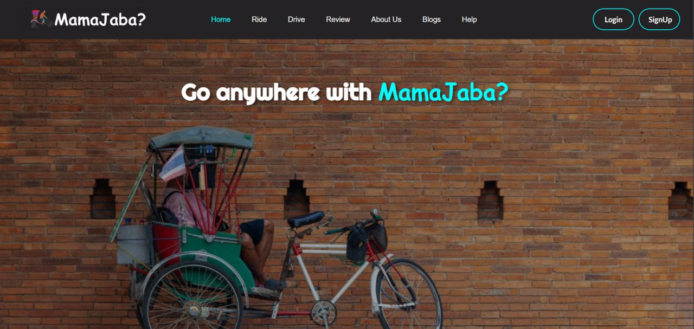
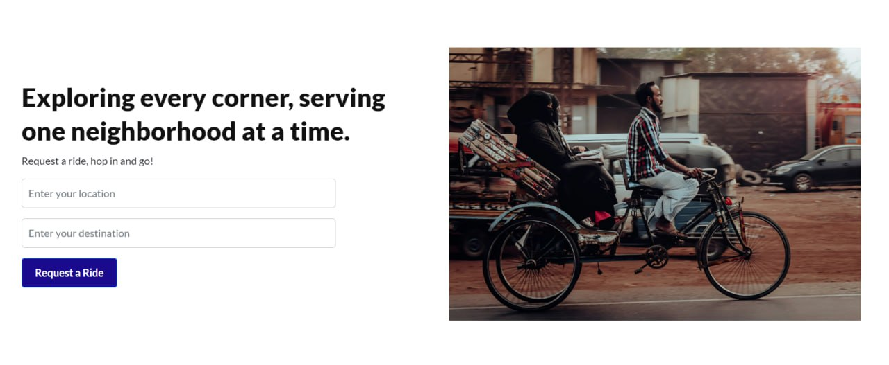
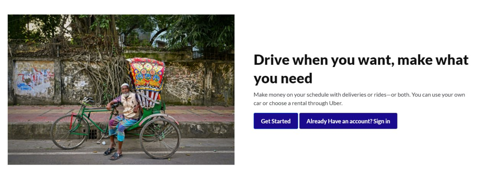
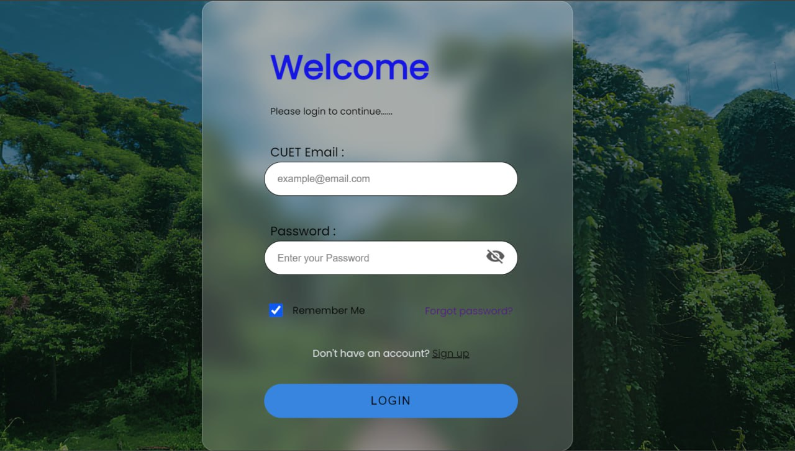
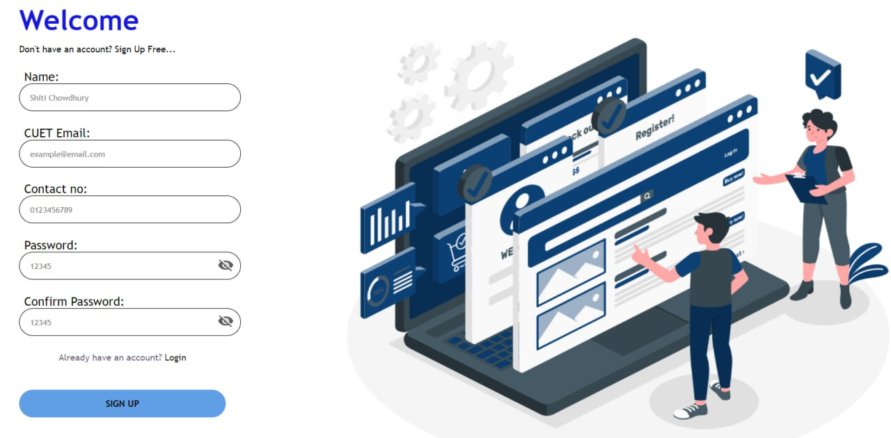
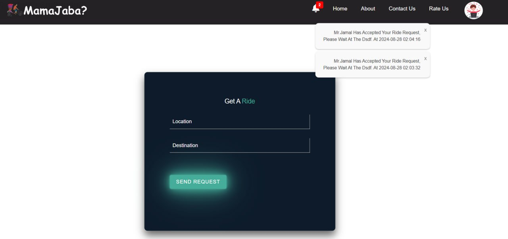
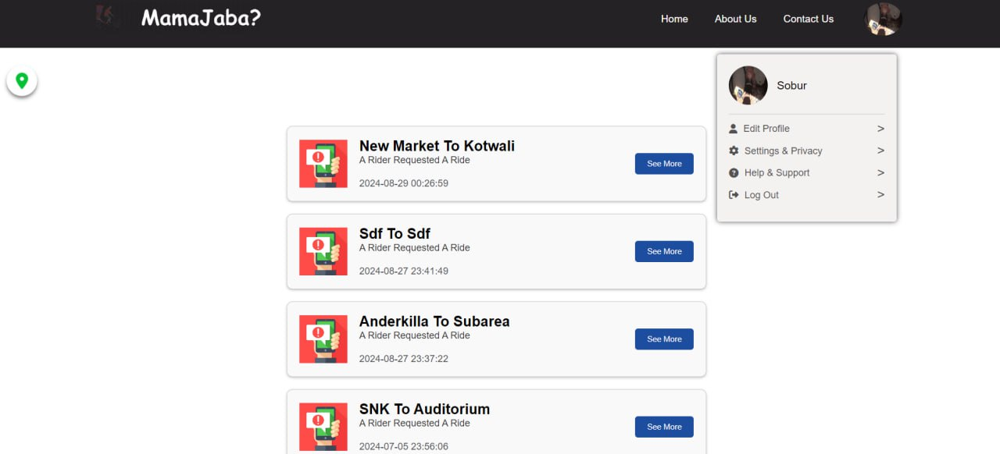
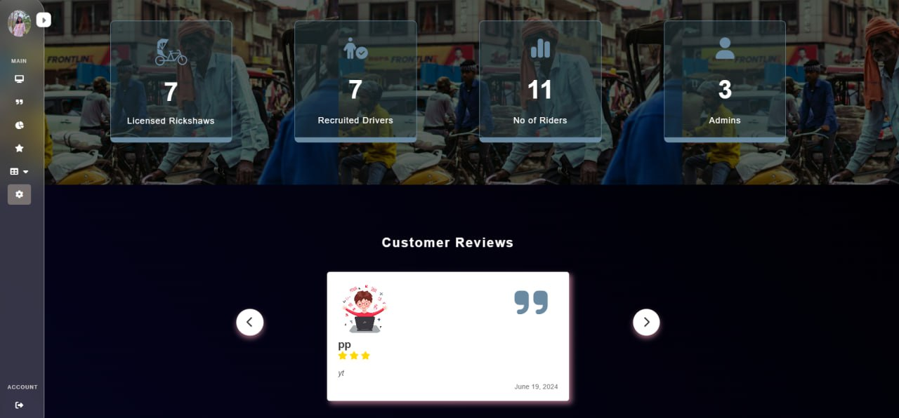
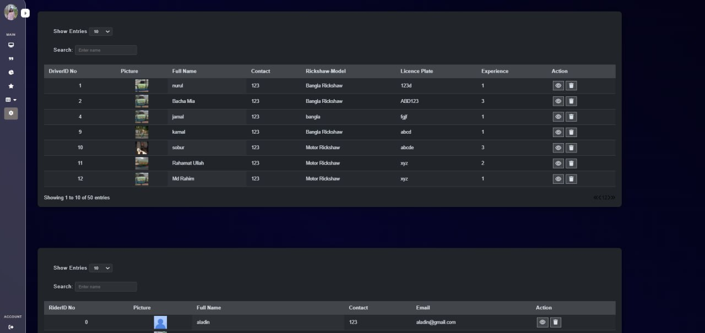

[# IP_MamaJaba](https://adibafc.github.io/IP_MamaJaba/)

# Project's Title
MamaJaba Rickshaw Ride-Calling Website

# Project Description
MamaJaba is designed to address transportation challenges at CUET by offering an efficient platform for rickshaw rides.

# Tech Stack
- **Frontend**: 
  
  
  
  
  
  
  
  
  
- **Backend**: 
  
  

- **Environment**: 
  

- **Data Handling**: 
  
  

# Features
- **Real-time Ride Requests**
- **User Roles**
- **Secure Login**
- **Responsive Design** 

# Usage
After setting up the project, you can start using the MamaJaba Rickshaw Ride-Calling Website. Below are instructions for each user role:

### For Riders
1. **Register/Log In:**
   - Navigate to the login page.
   - If you are a new user, click on "Sign Up" to create an account. Fill in the required details and submit the form.
   - If you already have an account, enter your credentials and click "Log In."

2. **Request a Ride:**
   - After logging in, go to the "Request Ride" page.
   - Enter your current location and destination.
   - Click on "Request Ride" to submit your request.

### For Drivers
1. **Register/Log In:**
   - Navigate to the login page.
   - If you are a new driver, click on "Sign Up" to create an account. Provide necessary driver details and submit the form.
   - Existing drivers can log in using their credentials.

2. **View Ride Requests:**
   - After logging in, go to the "Available Rides" page.
   - View the list of ride requests from riders. You can accept or decline requests based on your availability.
   
### For Admins
1. **Log In:**
   - Navigate to the admin login page.
   - Enter your admin credentials to access the admin dashboard.

2. **Manage Users:**
   - Go to the "Admin Dashboard" section to view and manage both riders and drivers.
   - You can view or remove users as needed.

# Screenshots

Here are some screenshots to guide you through the application:

- ## **Landing Page:**
&nbsp;
- 
- 
- 
- 
  &nbsp;
  &nbsp;
- ## **Login Page:**
- 
&nbsp;
&nbsp;
- ## **SignIn Page** 
  &nbsp;
  &nbsp;
-##  **Rider’s Request Page:** 
 &nbsp;
 &nbsp;
- ## **Driver’s Dashboard:** 
- ## **Admin’s Dashboard:** 
- 

# Contact
For any inquiries or contributions, feel free to reach out:
- **GitHub**:
-  https://github.com/AdibAFC
- https://github.com/PrithS24
- https://github.com/SHITICHY21

# Contributing
Contributions are welcome! To contribute:

- Fork the repository.
- Create a new branch (git checkout -b feature-branch).
- Make your changes.
- Commit your changes (git commit -m 'Add some feature').
- Push to the branch (git push origin feature-branch).
- Open a pull request.
  
This `README.md` file is structured to give a comprehensive overview of your MamaJaba project, including tech stack, features, usage, contribution guidelines and contact details. Feel free to adjust the contact information and any other specifics to suit your needs.

